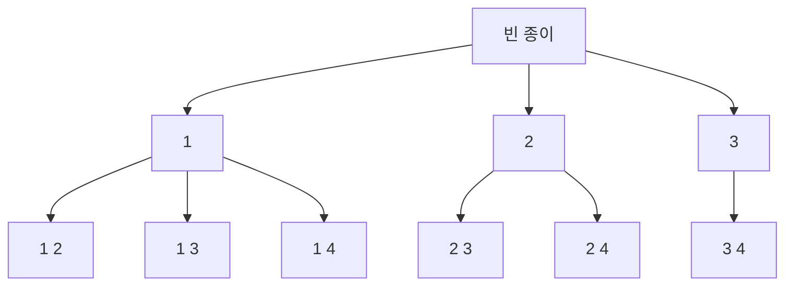

> 크래프톤 정글 기간에 쓴 글을 2026-08-18에 다시 정리했다.
{: .prompt-info }

## 이번 주 목표

> 주가 시작할 때 세운 목표다.
{: .prompt-info }

2주차는 알고리즘 공부를 하는 기간이다.<br>
나는 복수전공을 했다고 해도 비전공자라고 해도 무방할 정도라, 파이썬 코드를 작성하는 것 자체도 거의 처음이라고 생각하면 된다.

이번 주에 하기로 한 것은 다섯 가지다.

1. 부족한 파이썬 개념 다지기
2. Basic과 난이도 하 문제까지 풀기
3. 코어 타임에서 포기하지 않고 문제를 풀어내기
4. OpenAI 워크샵에서 결과물 완성하기
5. 수요 코딩회에서 프로젝트 만들기

**파이썬 개념** — 크래프톤 정글에서 제공해준 [파이썬 개념 공부 링크 페이지](https://www.w3schools.com/python/default.asp)에서 먼저 개념 공부를 진행하려 한다.

**문제 등급** — 크래프톤 정글에서 제공되는 알고리즘 문제의 등급으로는 Basic, 난이도 하, 난이도 중, 난이도 상, Extra가 존재한다.<br>
그중 Basic과 난이도 하 문제까지 푸는 것을 목표로 잡았다.

**코어 타임** — 코딩 테스트 시험 환경처럼 시간을 정해두고, 그 시간 내에 문제를 하나 정해 푸는 시간이다.<br>
나는 코어 타임에서 포기하지 않고 문제를 풀어내는 것이 목표다.

**OpenAI 워크샵** — 이번 주에 OpenAI가 와서 코딩 워크샵을 하고, 약 3시간 동안 하나의 결과물을 만들어야 한다고 한다.<br>
Codex를 제공해준다고 하니 그것으로 프로젝트를 완성하는 것이 목표다.

**수요 코딩회** — 이번 기수부터 생겼다고 한다.<br>
매주 수요일마다 AI를 적극 활용해서 하나의 프로젝트를 만드는 자리인데, 하루 만에 팀원들과 완성해야 한다. 여기서도 Codex를 활용해 좋은 프로젝트를 만들고자 한다.

## 어디까지 어떻게 시도했는가

**파이썬 개념 · Basic 문제** — 크래프톤 정글에서 이번 2주차 문제를 제공해주어 확인을 해봤다. 그런데 생각한 것보다 난이도가 있었다.<br>
처음이니까 조건문, 반복문 정도를 생각했는데 첫 주부터 재귀 같은 개념이 바로 나왔다. 내 입장에서는 "Basic이 Basic이 아닌데..." 하는 생각이 들었다.<br>
적어도 개발을 어느 정도 할 수 있거나 백준 실버 이상은 되어야 문제를 풀 수 있겠다는 생각이 들었다.

과거에 파이썬을 겉핥기로 학습했다.<br>
이번에 문제 풀이를 하면서 기초 개념이 부족함을 처절하게 깨달았고, Basic 문제 풀이를 진행하면서 동시에 백준 단계별로 풀어보기도 진행했다.

목표는 난이도 하까지였지만 Basic의 백트래킹 문제에서 막혀 거기까지 가지 못했다.<br>
백트래킹은 아래 「새롭게 배운 점」에 따로 정리했다.

**코어 타임** — 끝까지 붙잡고 있었지만 시간 안에 풀어내지는 못했다.

**OpenAI 워크샵** — 우리 조는 운동 메이트를 찾아주는 「gym-buddy」를 만들었다.<br>
종목과 지역, 시간대, 원하는 분위기로 조건을 걸면 맞는 사람과 소모임이 나오고, 직접 소모임을 열 수도 있게 했다. React와 Vite로 화면만 만들었고 데이터는 미리 넣어둔 값을 썼다.

**수요 코딩회** — 우리 조는 「시장 커뮤니티 분석 사이트」를 만들었다.<br>
뉴스와 시장 데이터, 커뮤니티 반응, 정치 이슈를 한 화면에서 보는 것이 목표였고, 디시인사이드와 뽐뿌의 정치 갤러리·주식 갤러리를 대상으로 잡았다.

가장 고민한 것은 혐오지수를 어떻게 숫자로 만들 것인가였다. 결국 사전 방식으로 갔다.<br>
혐오·공격 표현을 모아둔 단어 사전을 만들어 두고, 글에 그 단어가 몇 번 나오는지 센 다음 한 번에 12.5점씩 매겨 0에서 100 사이로 잘랐다.<br>
여덟 번 이상 나오면 100점이 된다.

```python
hate_hits = sum(any(term in token for term in HATE_OR_AGGRESSION_WORDS) for token in combined_tokens)
hate_index = max(0.0, min(100.0, hate_hits * 12.5))
```

다만 이 방식은 그 단어가 왜 나왔는지는 보지 못한다.<br>
혐오를 말리는 글이라도 단어가 여러 번 나오면 점수가 올라간다.

백엔드는 FastAPI, 프론트는 Next.js로 만들고 Docker Compose로 묶었다.

## 새롭게 배운 점

Basic 문제를 풀어보다가 백트래킹 문제를 풀게 되었다.<br>
n개의 숫자 중에서 k개를 고르는 모든 조합을 찾는 문제였다. n이 4이고 k가 2면
`[1,2] [1,3] [1,4] [2,3] [2,4] [3,4]`가 답이다. 조합이라 `[1,2]`와 `[2,1]`은 같은 것으로 본다.

문제 파악 자체를 하기 힘들어 유튜브에서 백트래킹을 설명해주는 영상을 찾아 시청하였다.
보고 이해한 것을 정리하면 이렇다.

### 백트래킹이란

미로에서 출구를 찾는다고 생각하면 쉽다.<br>
아무 생각 없이 다 해보는 방법은 갈림길마다 아무 길이나 골라 끝까지 걸어간다.
막다른 길이어도 벽에 닿을 때까지 가보고, 그제서야 돌아온다.

백트래킹은 가다가 "이쪽은 아니겠는데" 싶으면 끝까지 가지 않고 그 자리에서 돌아선다.<br>
back(뒤로) + track(길). 돌아선다는 뜻이 이름에 그대로 들어 있다.

### 백트래킹 3단계

**선택(Choose) → 탐색(Explore) → 취소(Unchoose)**

말은 어려워 보이지만, 종이 한 장과 지우개로 하는 일과 같다.<br>
종이에 숫자를 적어 나가다가 다 채워지면 정답 노트에 옮겨 적고, 방금 적은 것을 지운다.

| 단계 | 종이로 치면 |
|---|---|
| 선택 | 숫자 하나를 **종이에 적는다** |
| 탐색 | 아직 다 안 찼으니 **계속 적으러 간다** |
| 취소 | 방금 적은 숫자를 **지우개로 지운다** |

`n=4, k=2`, 그러니까 1부터 4까지 중에서 2개를 고르는 경우를 따라가 보자.
종이에 무엇이 적혀 있는지만 보면 된다.

| | 하는 일 | 종이 |
|---|---|---|
| 1 | 1을 적는다 | `1` |
| 2 | 아직 하나뿐이니 계속 적으러 간다 | `1` |
| 3 | 2를 적는다 → 2개를 채웠으니 정답 노트에 `1 2` | `1 2` |
| 4 | **2를 지운다** | `1` |
| 5 | 3을 적는다 → 정답 노트에 `1 3` | `1 3` |
| 6 | **3을 지운다** | `1` |
| 7 | 4를 적는다 → 정답 노트에 `1 4` | `1 4` |
| 8 | **4를 지우고 1도 지운다** | 빈 종이 |
| 9 | 2를 적는다. 처음부터 다시 | `2` |

4번과 6번, 그러니까 **지우는 동작을 빼면 어떻게 될까.**<br>
직접 돌려보니 정답이 `[1, 2]` 하나만 나오고 끝났다.
종이에는 `[1, 2, 3, 4, 4, 2, 3, 4, 4, 3, 4, 4]`가 남아 있었다.
적기만 하고 지우지 않으니 종이가 꽉 차서 `1 3`을 적을 자리가 없었던 것이다.

3단계 중에서 **취소만 백트래킹 고유의 동작**이고, 나머지 둘은 원래 하던 일이다.<br>
그리고 사람은 종이에 적다 보면 자연스럽게 지우지만,
컴퓨터는 「지워라」라고 적어주지 않으면 절대 지우지 않는다.

### 그림으로 보면

종이에 적어 나가는 과정을 그림으로 그리면 나무 모양이 된다.



- **아래로 내려가는 것**이 「적는다」이고
- **위로 되돌아오는 것**이 「지운다」이다
- 맨 아래 칸에 닿으면 2개가 찼다는 뜻이라, 정답 노트에 옮겨 적는다

`1 2`까지 내려갔으면 정답 하나를 얻은 것이다. 그런데 `1 3`으로 가려면
먼저 `1`까지 **되돌아 올라와야** 한다. 그 올라오는 동작이 곧 지우기다.<br>
맨 아래 칸이 여섯 개인데, 그게 정답 여섯 개다.

4로 시작하는 가지는 그리지 않았다. 4를 먼저 고르면 그보다 큰 수가 없어서
2개를 채울 수 없기 때문이다. 실제 코드는 거기까지 가보고 아무것도 못 만든 채 돌아온다.<br>
이런 헛걸음을 미리 잘라내는 것이 앞에서 말한 가지치기다.

### 중복을 막는 방법

현재 숫자보다 큰 숫자만 고르면 중복이 생기지 않는다.<br>
`[1,2]`를 만들고 나면 `[2,1]`을 다시 만들 일이 없기 때문이다.

### 여기서 막혔다

3단계는 이해했는데 코드로 옮기지 못했다. 막힌 곳은 세 군데였다.

**「다 골랐다」를 무엇으로 판단할지**<br>
나는 `start == k`로 두었다. 그런데 `start`는 몇 번 숫자부터 볼지를 가리키는 값이고
`k`는 몇 개를 고를지를 뜻하는 값이다. 단위가 다른 둘을 비교하고 있었던 것이다.
알고 싶은 건 「지금 몇 개 골랐나」인데, 그 개수를 어디서 세야 하는지가 안 잡혔다.

**고른 것을 어디에 담을지**<br>
정답 노트에 해당하는 `result` 하나에 숫자를 직접 적고 지웠다.
종이와 정답 노트를 따로 두지 않은 것이다.
답이 `[[1,2],[1,3],...]`처럼 리스트 안의 리스트인 이유가 여기 있었는데 그때는 몰랐다.

**하나를 고른 다음 어디서부터 다시 볼지**<br>
여기서 제일 오래 붙잡았다. `backtrack(start + 1, ...)`이라고 썼는데,
`start`는 함수가 시작될 때 받은 값이라 for문이 도는 동안 변하지 않는다.
무엇을 고르든 다음은 늘 같은 자리부터 보게 된다.
n이 4이고 k가 2면 `[2,2]`처럼 같은 숫자를 두 번 고르거나,
`[2,3]`과 `[3,2]`를 둘 다 만들어버린다.

「현재 숫자보다 큰 숫자만 고르라」는 힌트는 읽었다. 그런데 그 말을 코드의 어느 자리에
넣어야 하는지가 안 잡혔다.<br>
결국 이번 주에는 풀지 못했다.

## 다음주 계획

2주차 때의 문제가 생각보다 어려워 계획한 부분까지 완료하지 못했다. 못 푼 부분을 풀면서 전체적으로 복습을 하여 나의 것으로 만들어야겠다고 생각한다. ㅠㅠ<br>
다음 주도 Basic 폴더의 내용과 난이도 하 문제를 다 푸는 것을 목표로 할 것이다.