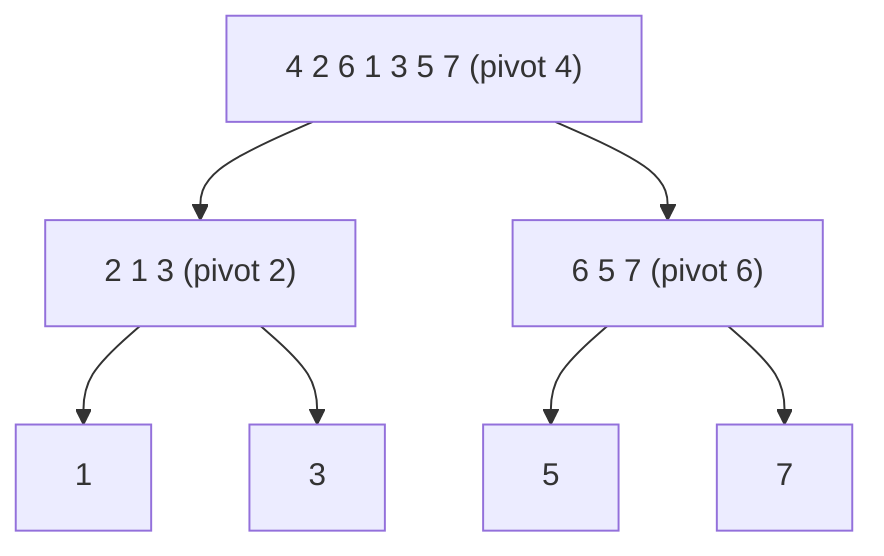

> 크래프톤 정글 기간에 쓴 글을 2026-08-20에 다시 정리했다.
{: .prompt-info }

## 이번 주 목표

> 주가 시작할 때 세운 목표다.
{: .prompt-info }

3주차도 알고리즘 공부를 하는 기간이다. 
지난 주에 백트래킹에서 막히면서 Week 2의 진도가 밀린 상태다.
개념을 다지려고 백준 「단계별로 풀어보기」도 병행하고 있다.

이번 주에 하기로 한 것은 두 가지다.

1. Week 3의 Basic 폴더와 난이도 하 문제까지 풀기
2. 수요 코딩회에서 미니 레디스(Mini Redis) 구현하기

**미니 레디스** — 이번 주 수요 코딩회 과제다. 
지금은 이것이 무엇인지 모르지만, 수요일 전까지 어떤 주제로 구현할지 찾아봐야겠다.

## 어디까지 어떻게 시도했는가

**자료구조 학습** — 크래프톤 정글에서 3주차 문제를 제공해주었다. 
자료구조 중 가장 기본으로 불리는 이분 탐색, 분할 정복, 퀵 정렬, 머지 정렬,
스택, 큐, 우선순위 큐, 연결 리스트, 해시 테이블을 학습하였다.

AI를 활용해 공부했는데, 「초등학생에게 설명하는 것처럼 쉽고 자세하게 설명해줘」라는
프롬프트를 주면서 개념을 익혔다. 
그런데 많은 정보가 한 번에 들어오다 보니 계속 혼동이 왔다. 그래서 **나만의 개념 노트**를 만들었다.
앞으로도 개념 노트를 참고하면서 비슷한 유형의 문제를 계속 풀어보려고 한다.

**문제 풀이** — Basic 폴더의 문제는 다 풀었지만 난이도 하, 중, 상, Extra 문제는 풀지 못하였다. 
나는 왜 이렇게 못할까 하고 자책하기도 했다. 그래도 더 열심히 차근차근 해봐야겠다고 생각하였다.

**수요 코딩회** — 미니 레디스 구현을 진행하였다. 
주제는 「해시 테이블을 활용하여 키-값(key-value) 저장소를 직접 만들어라」였다.
중점 포인트는 셋이었다.

- 동시성 문제가 발생하면 안 된다
- TTL을 인지하며 구현해야 한다
- CRUD 단위 테스트로 검증한다

우리 팀은 이것으로 열차 예매 사이트를 만들었다.

## 새롭게 배운 점

다양한 개념을 많이 배웠지만 가장 기억에 남는 것은 **퀵 정렬**이다. 
혼자 끙끙거리며 풀다가 개념이 정리되지 않아서 팀원들에게 물어보며 정리했기 때문이다.
이 경험을 통해 소통과 협업의 중요성을 더 깨닫게 되었다.

퀵 정렬은 기준이 되는 값 하나(pivot)를 고르고, 그보다 작은 쪽과 큰 쪽으로 배열을 나눈다. 
그러고 나서 왼쪽과 오른쪽을 각각 같은 방식으로 다시 정렬한다.
같은 일을 더 작은 조각에 반복하므로 재귀를 쓴다.

### 퀵 정렬의 3단계

1. **분할** — pivot을 기준으로 작은 쪽과 큰 쪽으로 나눈다
2. **정복** — 왼쪽과 오른쪽을 각각 재귀로 정렬한다
3. **결합** — 왼쪽 + pivot + 오른쪽

### 그림으로 보면

`4 2 6 1 3 5 7`을 정렬하는 과정을 그리면 나무 모양이 된다.

- **아래로 내려가는 것**이 분할이다. pivot보다 작은 쪽과 큰 쪽으로 계속 쪼갠다
- **맨 아래 칸**은 숫자가 하나뿐이라 더 나눌 수 없다
- **위로 올라오면서** 왼쪽 + pivot + 오른쪽 순서로 붙이면 정렬이 끝난다

내가 자꾸 까먹었던 base case가 바로 이 맨 아래 칸이다. 
「더 나눌 게 없으면 멈춰라」를 적어두지 않으면 쪼개고 또 쪼개다가 끝나지 않는다.

> 내가 계속 까먹었던 것은 base case의 존재다. 절대 잊지 말자.
{: .prompt-warning }

## 다음 주 계획

다음 주에는 트리, 이진 검색 트리, 그래프, BFS, DFS, 위상 정렬을 학습한다고 한다. 
BFS와 DFS 같은 개념은 코딩 테스트를 준비하려면 완벽하게 공부해야 한다고 생각한다.

수요 코딩회에서는 Virtual DOM과 Diff 알고리즘을 구현한다고 한다. 
지금은 이것이 뭔지 모르지만, 일주일 동안 열심히 학습해서 다음 주 프로젝트도 잘 끝내고 싶다.