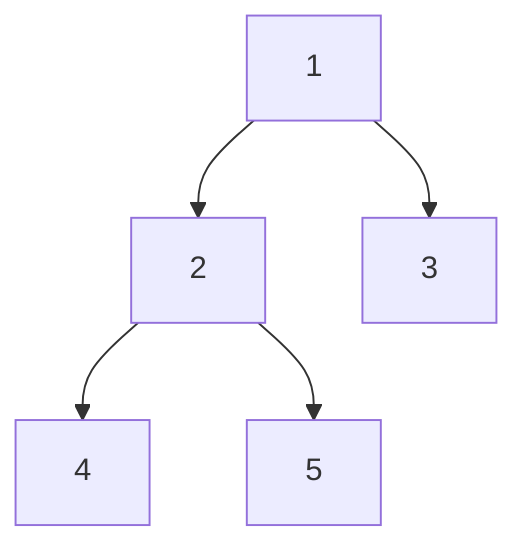

> 크래프톤 정글 기간에 쓴 글을 2026-08-21에 다시 정리했다.
{: .prompt-info }

## 이번 주 목표

> 주가 시작할 때 세운 목표다.
{: .prompt-info }

4주차도 알고리즘 공부를 하는 기간이다. 
나는 사실 3주차 때까지 알고리즘 공부에 재미를 못 느꼈다.

이번 주에 하기로 한 것은 세 가지다.

1. Week 4의 Basic 폴더를 무조건 다 풀기
2. 난이도 하 문제까지 풀기
3. 수요 코딩회에서 Virtual DOM과 Diff 알고리즘 구현하기

그리고 하나 더. **이번 주에는 알고리즘 공부에 재미를 붙여볼 예정이다.**

**난이도 하** — 이제 난이도 하 문제가 백준 실버 등급이어서 부담스러운 상황이다. 
그래도 최대한 공부해보려 한다.

**Virtual DOM과 Diff** — 이번 주 수요 코딩회 과제다. 
React가 프론트엔드 분야에서 많이 사용된다는 것은 알고 있지만 내가 직접 React를 활용해
구현해 본 경험이 없다. 이번 기회에 React를 어떻게 쓰는지, DOM과 Virtual DOM은 무엇이고
왜 쓰는지를 찾아볼 것이다.

## 어디까지 어떻게 시도했는가

**알고리즘 문제** — 크래프톤 정글에서 4주차 문제를 제공해주었다.
이진 트리, 이진 탐색 트리, 그래프, BFS, DFS, 위상 정렬을 풀어야 했다. 
Basic 중 위상 정렬은 하지 못했고 나머지는 다 풀었다. problem-solving의 난이도 하 문제는
전부는 아니지만 거의 다 풀었다. 한 문제를 여러 가지 방법으로 풀어보기도 하였다.

**공부 방법을 바꿨다** — 이번 주부터 공부 방법이 바뀌어서 학습 시간이 조금 더 걸렸다. 
지난 주에는 AI에게 「초등학생에게 설명하는 것처럼 설명해줘」라는 프롬프트를 주면서 공부했다.
이번 주에는 이렇게 바꿨다.

1. 내 저장소에 `AGENT.md` 파일을 만든다
2. 그 파일에 **공부 모드**를 적어둔다 — 코드로 설명하지 말고 흐름을 설명해 줄 것, 내가 코드를 쓸 수 있게 힌트만 줄 것

이렇게 하니 AI가 코드를 먼저 보여주는 대신 **왜** 쓰는지, 어떻게 쓰는지,
어떤 경우에 주로 쓰는지, 구현하려면 어떤 흐름으로 써야 하는지를 알려준다. 
공부 방법을 바꾸니 내가 좋아하는 방식이어서 즐기면서 알고리즘을 학습하였다.
칭찬을 섞어 이끌어주는 방식이 나와 맞는다는 것도 이번에 알게 되었다.

**수요 코딩회** — Virtual DOM과 Diff 알고리즘을 구현하였다.
우리 조는 Core, Diff, Patch/State, UI로 역할을 나눴고 나는 **Diff**를 맡았다. 
사실 역할을 나눌 때는 뭐가 뭔지 잘 몰라서 Diff가 가장 쉬울 거라고 생각하고 골랐다.
그런데 하다 보니 손이 제일 많이 가고 소통이 가장 많이 필요한 부분이었다. 
Patch를 담당하는 팀원과 계속 소통하면서 인수인계하는 방식으로 진행했고, 큰 충돌 없이 끝났다.

**협업 방식** — 발표 중에 코치님이 물으셨다. 저렇게 역할을 나누면 충돌이 날 확률이 높은데
안 났느냐고. 충돌은 한 번 났는데 ui 폴더의 한 파일에서만 났고, 충돌난 코드를 다 살려도
되는 상황이어서 쉽게 넘어갔다고 답했다.

발표가 끝나고 **왜 우리는 충돌이 나지 않았을까**를 다시 생각해봤다.

- 브랜치를 `main` → `dev` → 각자 맡은 파트로 나눠서 진행했다
- push, PR, PR 리뷰, merge 순서를 지켰다
- 다른 팀원이 merge하면 **바로 pull해서 반영**했다
- 내가 하던 부분에서 팀원이 이어받아야 할 것은 **인수인계를 명확히 해서** 전달했다

프로젝트가 끝나고 팀원들과 KPT 회고를 했다.

| | 내용 |
|---|---|
| **Keep** | 코드 리뷰(주석 활용) · 협업(Skill 사용) · 분위기 · 인수인계 |
| **Problem** | 초반 주도적인 태도 부족 · 프로젝트 핵심 파악 부족 |
| **Try** | 핵심 목표를 체크리스트와 GitHub Issue로 관리 · 프로젝트에 임하는 마음가짐 · 기술을 왜 쓰고 왜 안 쓰는지 미리 공부 |

지금까지 한 프로젝트 중 가장 체계적으로 진행됐고, AI를 활용하는 내 스킬도 늘었다는 걸 느꼈다.

> 발표는 내가 했다. 사실 나는 발표가 두렵다. 
> 계속 하다 보면 나아진다고들 하는데, 아직은 그렇다.
{: .prompt-info }

### 내가 프로젝트를 대하는 방식

1. AI에게 내가 맡은 부분을 **어떤 순서로 구현해야 할지 흐름부터** 잡아달라고 한다
2. 요청할 때는 구현한 이유와 함수 설명을 **주석으로 자세하게** 써달라고 한다
3. AI가 준 코드를 **직접 읽어보고**, 반영해도 되겠다는 판단이 서면 그때 내 폴더에 반영한다
4. 맡은 부분의 `README.md`에 놓친 것, 오류가 난 것, **인수인계할 것**을 적어달라고 한다
5. 수정한 부분과 `README.md`를 commit·push·merge하고, 인수인계는 슬랙으로 한 번 더 알린다

## 새롭게 배운 점

BFS와 DFS가 중요하다는 것은 알고 있었다. 그런데 둘을 구분하기가 힘들고 이해하기도 어려웠다. 
이번에 Codex 선생님과 함께 학습하면서 정리했다.

**둘 다 「빠짐없이 다 둘러보기」인데, 둘러보는 순서가 다르다.**

| | 방문 순서 | 어떻게 도는가 |
|---|---|---|
| **BFS** | 1 → 2 → 3 → 4 → 5 | 가까운 칸부터. **한 층을 다 보고** 다음 층으로 |
| **DFS** | 1 → 2 → 4 → 5 → 3 | **갈 수 있는 데까지 내려갔다가** 돌아 나온다 |

### BFS

- **큐(queue)** 를 쓴다. 먼저 발견한 칸을 먼저 봐야 하니, 먼저 들어온 것이 먼저 나오는 큐가 맞는다
- **방문 체크**가 필요하다. 안 하면 같은 칸을 또 본다
- 흐름 — 시작 칸을 큐에 넣는다 → 큐가 빌 때까지 반복 → 꺼낸 칸의 이웃을 큐에 넣는다

### DFS

- **재귀**를 쓴다. 한 칸 들어가서 같은 일을 반복하기 때문이다
- **방문 기록**이 필요하다. BFS와 같은 이유다
- 이럴 때 쓴다 — 그래프·트리 탐색, 연결 요소 찾기, 경로가 있는지 확인, 백트래킹

DFS의 **「갈 데까지 갔다가 돌아 나온다」** 가 Week 2에서 정리한 백트래킹과 같은 동작이다. 
그때는 종이에 적었다 지웠는데, 여기서는 길을 들어갔다 되돌아 나온다.

> BFS와 DFS를 자세히 정리한 글은 따로 써두었다.
{: .prompt-info }

## 다음 주 계획

다음 주는 마지막 알고리즘 주간이다. 마지막은 **그리디 알고리즘**과 **DP**를 진행한다고 한다. 
그리디와 DP, BFS, DFS는 코딩 테스트 단골 문제라는 것을 알고 있다.
매우 중요한 내용이니 Basic은 반드시 해결해야 한다.

그리고 다음 주에 **CSAPP 교재 1장을 반드시 읽어봐야 한다.**
알고리즘 주간이 끝나면 C 언어를 진행하기 때문이다. 
시간이 되면 Week 2, Week 3, Week 4에서 학습한 내용도 한 번 더 보고 싶다.

수요 코딩회에서는 이번에 만든 Virtual DOM과 Diff 알고리즘을 더 확장한다고 한다. 
React의 핵심 기능인 Component, State, Hooks를 직접 구현하고, 이걸로 동작하는 웹 페이지를 만들어본다고 한다.
