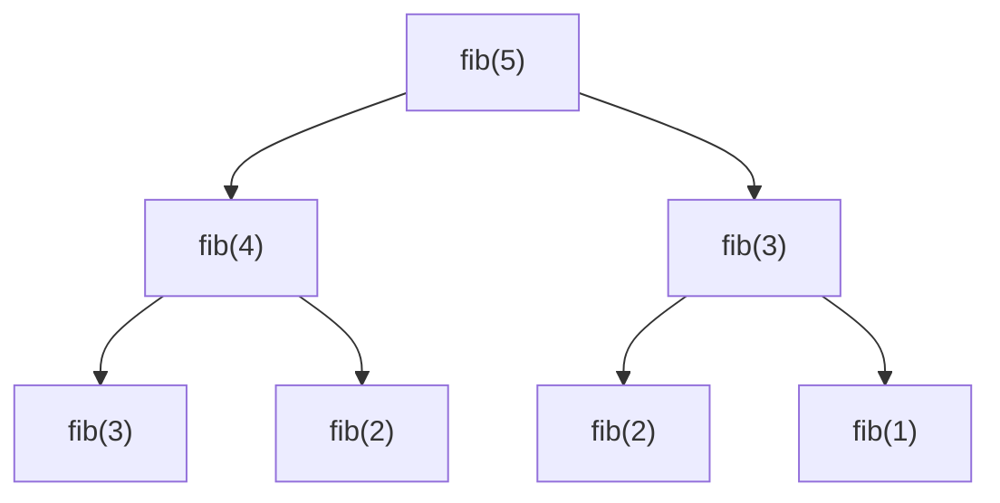

> 크래프톤 정글 기간에 쓴 글을 2026-08-21에 다시 정리했다.
{: .prompt-info }

## 이번 주 목표

> 주가 시작할 때 세운 목표다.
{: .prompt-info }

이번 주가 마지막 파이썬 알고리즘 주간이다. 
알고리즘을 마무리하는 주간이라, 5주간의 나를 되돌아볼 수 있는 주라고 생각한다.

이번 주에 하기로 한 것은 네 가지다.

1. DP와 그리디 알고리즘 문제 풀기
2. CSAPP 교재 1장 읽기
3. 수요 코딩회에서 Component, State, Hooks 구현하기
4. 이번 주가 끝나도 파이썬 알고리즘을 하루 1시간이라도 꾸준히 복습하기

**DP** — 예전에 풀어봤는데 지금은 거의 백지 상태다. 
그래도 지난 주에 나만의 알고리즘 학습 방법을 찾았으니, 이번 주도 그 방법으로 해볼 생각이다.

**CSAPP** — 대학생 때 CS 공부를 했었는데 너무 힘들고 어려웠던 기억이 있다. 
그때 제대로 하지 않아서 지금 힘든 거라고 생각한다. 지금 안 하면 나중에 더 힘들 테니
이번에는 제대로 해야겠다고 다짐했다.

**수요 코딩회** — 지난 주에 만든 Virtual DOM과 Diff 알고리즘을 발전시키는 과제다. 
React의 핵심 기능인 Component, State, Hooks를 직접 구현하고, 그것으로 동작하는
웹 페이지를 만든다.

## 어디까지 어떻게 시도했는가

**알고리즘 문제** — 크래프톤 정글에서 5주차 문제를 제공해주었다.
이번 주에는 그리디와 DP 문제를 풀어야 했다. 
코어타임 4문제도 모두 DP 관련 문제였다.

**수요 코딩회** — 4주차 프로젝트를 발전시켜, React의 핵심 기능인 Component, State, Hooks를
직접 구현하고 그것으로 동작하는 웹 페이지를 만들었다.

주마다 팀이 바뀌기 때문에 프로젝트 선택지가 넷이었다.
「개발자 키우기」, 「수사 보드」, 「스마트홈」, 「Geo-camo Rendering Engine」.
각자 프로젝트를 확인한 뒤 투표로 「개발자 키우기」를 골랐다.

AI에게 4명의 역할을 어떻게 나누면 좋을지 물어보고, 그중 원하는 것을 골랐다.
나는 `game.js`와 `gameComponents.js`를 맡았다.

화면을 컴포넌트 단위로 쪼개고 그것을 게임 상태와 연결하는 구조까지 진행했다. 
먼저 프로필 화면을 여러 하위 컴포넌트로 나눈 뒤 `ProfileCard`로 조립하도록 리팩터링했고,
`game.js`와 연결해 상태 변화가 화면 갱신으로 이어지도록 구성했다.

과제 조건 중에 **batching**이 있었다. 선택 사항이었지만 개념을 공부해서 구현했다. 
상태가 바뀔 때마다 즉시 렌더링하는 방식의 한계를 줄이려고 batching 구조를 도입했고,
여러 `setState`를 한 번의 업데이트로 묶는 방식도 구현했다.

마지막으로 팀원들과 `README`를 계속 고치면서, 개념적으로도 설명할 수 있도록 정리했다.

## 새롭게 배운 점

### DP

먼저 DP 개념 학습을 진행했고, **어떤 조건일 때 DP를 쓰는지**부터 공부했다. 
DP에는 탑다운 방식과 보텀업 방식이 있다는 것을 알게 되었고, 둘의 구현 방법과
각각 무엇을 반드시 필요로 하는지를 파악했다.

**왜 DP가 필요한가.** 피보나치 수를 그냥 재귀로 구하면 이렇게 된다.

`fib(3)`이 두 번, `fib(2)`가 세 번 나온다. **이미 계산한 것을 또 계산하고 있다.** 
이 낭비를 없애는 것이 DP다.

### 메모이제이션 — 탑다운 방식

- 한 번 계산한 결과를 메모리에 적어두는 기법
  - 같은 문제를 다시 만나면 적어둔 결과를 그대로 가져온다
  - 값을 기록해 둔다는 점에서 캐싱(caching)이라고도 한다
- **재귀**를 사용한다

### 보텀업 방식

- 반복문을 사용해서 **작은 값부터 순서대로** 채운다
- 피보나치 수열은 보텀업 방식이 더 자연스러운 편이다
- 다른 문제를 풀 때도 보텀업이 더 자연스러운 경우가 많다

## 이번 주 아쉬웠던 점

아쉬웠던 점은 **CSAPP 공부를 깊게 하지 못했다는 것**이다. 
알고리즘을 학습하느라 CS 공부를 이틀 정도밖에 하지 못했다.
다음 주부터 C를 진행하는데 서둘러야겠다고 깨달았다.

이번 주 KPT 회고에서도 같은 이야기가 나왔다.

| | 내용 |
|---|---|
| **Keep** | 코어타임 시간 외에도 알고리즘 학습 공유 · 수요코딩회 협업 역할 분배 · 수요코딩회 코드 리뷰 · 코어타임 일 2번(추가 문제) |
| **Problem** | 동료 학습 시간 부족 · CSAPP 동료 학습 부족 |
| **Try** | CSAPP를 각자 파트를 나눠서 동료 학습 · 원활한 소통 |

나만 느낀 게 아니라 **팀 전체가 CSAPP를 못 따라가고 있었다.**
그래서 다음 주에는 파트를 나눠 동료 학습을 해보기로 했다.

## 다음 주 계획

다음 주부터는 새로운 주간이 시작된다. 파이썬 알고리즘은 끝나고 C 언어를 진행한다고 한다. 
아직 시작해보지 못해서 어떤 것을 하는지 잘 모르지만, C도 포기하지 않고 해볼 생각이다.

C가 파이썬보다 어렵다고 하던데, 포인터와 malloc은 정보처리기사에서 보던 말이다.
그게 실제로 무엇인지 제대로 학습해봐야겠다.
