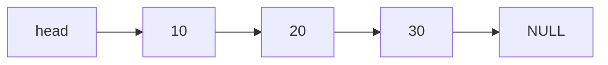

> 크래프톤 정글 기간에 쓴 글을 2026-08-21에 다시 정리했다.
{: .prompt-info }

## 이번 주 목표

> 주가 시작할 때 세운 목표다.
{: .prompt-info }

이번 주는 파이썬 알고리즘 주간이 끝나고, C 언어로 자료구조를 직접 다뤄보는 첫 주다. 
주를 시작하면서 「아, 정말 언어가 바뀌는구나」 하는 긴장감이 든다.
지금 제대로 해둬야 나중에 PintOS를 할 때 활용할 수 있겠다는 생각이 들어 걱정도 된다.

파이썬도 잘하는 것은 아니지만, 비교적 자연스럽게 다뤘던 자료구조를 C로 다시 구현해야 한다는 점이
부담스럽다. 한편으로는 그만큼 더 깊게 이해할 수 있는 기회가 될 것 같기도 하다.

이번 주에 하기로 한 것은 세 가지다.

1. `data_structures_docker` 안의 Linked List, Stack and Queue, Binary Tree,
   Binary Search Tree를 C로 풀기
2. CSAPP 3장 읽고 스터디에서 발표하기
3. 수요 코딩회에서 SQL Processor 구현하기

**자료구조** — 단순히 문제를 푸는 데 그치지 않고, 포인터와 구조체를 직접 다루면서
**자료구조가 메모리 위에서 어떻게 연결되는지**를 감각적으로 익히는 주로 만들고 싶다.

**CSAPP** — 6주차 팀원들이 모두 스터디에서 학습하기 때문에 나도 참여해보았다. 
발표도 해야 한다고 하니, 조금이라도 제대로 읽고 이해해보자는 마음으로 시작하려 한다.

**SQL Processor** — SQL 문장을 입력받으면 이를 해석하고, 명령의 종류에 따라
실제 동작으로 이어지도록 만드는 과제다. 
문자열을 읽는 것에서 끝나는 게 아니라, SQL을 파싱하고 그 결과를 바탕으로 저장·조회 같은
동작으로 연결하는 전체 흐름을 구현해야 한다.

이번 주는 C를 학습하면서 C와 파이썬 사이의 관계도 생각해보고,
**어떤 언어가 나에게 맞는지**도 가늠해볼 수 있는 주간이 될 것 같다.

## 어디까지 어떻게 시도했는가

### 자료구조 문제 풀이

이번 주부터 C로 자료구조 문제를 풀어야 했다. 
문제를 바로 풀기보다는 먼저 뼈대 코드와 문제 PDF를 보면서 어떻게 접근할지 감을 잡으려고 했다.

막상 시작해보니 파이썬과는 결이 많이 달랐다. 
파이썬에서는 비교적 자연스럽게 넘겼던 연결 구조를 C에서는 포인터와 구조체로 직접 다뤄야 했다.
그래서 문제를 푸는 내내 **「이 변수는 값을 담고 있는 건지, 주소를 담고 있는 건지」** 를
계속 확인해야 했다.

포인터가 전혀 감이 잡히지 않아 계속 헤매고 있을 때, 동석 코치님의 C 언어 기초 특강이
많은 깨달음을 주었다.

속도는 다른 동기들보다 느렸지만, 대신 한 줄 한 줄을 그냥 넘기지 않고 이해하려 했던 점은
나름 의미가 있었다고 생각한다. 
그리고 C부터는 이미 구현되어 있는 함수가 많고 나는 특정 함수만 구현하는 방식이었는데,
이미 있는 함수들도 Codex와 함께 분석하고 정리하면서 내 것으로 만들었다.

### CSAPP 3장

CSAPP 3장을 읽고 스터디에서 직접 발표했다. 
솔직히 쉽지는 않았다. 그런데 발표를 준비하면서 **「이 내용을 내가 다른 사람에게 설명할 수 있어야
한다」** 는 기준이 생겨 더 집중해서 읽게 되었다.

모르는 부분은 계속 찾아봤고, Codex에게는 개념의 예시를 들어달라고 했다.
그래도 이해가 안 되면 **실생활에서 흔히 접하는 것으로 바꿔서 설명해달라고** 했다.
그렇게 하니 조금 더 이해할 수 있었다.

특히 발표를 준비하면서 애매하게 넘겼던 부분들을 다시 붙잡고 보게 되었다. 
덕분에 그냥 읽고 지나갔으면 기억에서 사라졌을 개념들이 머릿속에 어느 정도 남았다.

여전히 쉬운 내용은 아니었지만, 열심히 학습해서 더 성장할 수 있겠다고 다짐하게 되었다.

### 수요 코딩회 — SQL Processor

이번 방식은 꽤 신박했다. 
하나의 기능을 역할별로 쪼개서 만드는 대신, **같은 기획서를 팀원 각자가 독립적으로 구현하고
그 결과물을 비교한 뒤 가장 좋은 것을 골라 통합하는** 방식이었다.

흥미로웠던 이유는 **같은 요구사항을 보고도 각자 구현 방식이 다르게 나왔다는 점**이다.
누군가는 구조를 더 단순하게 가져가고, 누군가는 확장성을 더 고려하고,
누군가는 구현 속도를 우선시했다.

결과물을 비교하는 과정 자체가 작은 코드 리뷰처럼 느껴졌다.
「이 부분은 내가 구현했어요」에서 끝나는 게 아니라 **「왜 이렇게 구현했는가」를 설명할 수 있어야
한다**는 점이 좋았다. 
사람들이 AI에게 주는 프롬프트를 직접 볼 수 있어서, 어떻게 요청해야 하는지도 더 배웠다.

그리고 그 과정에서 **내 결과물이 Best로 선정되었다.**

그 사실도 기뻤지만, 무엇보다 내가 생각한 구조와 구현 방향이 팀 안에서 설득력을 가졌고
AI가 여러 시각에서 평가했을 때 완성도와 확장성 면에서 높은 점수를 받았다는 점이 뿌듯했다. 
그래서 발표도 내가 하게 되었다. 그래도 사람들이 이전보다 발표가 많이 늘었다고 해주셨다.
조금씩 성장하고 있는 것 같아 기분이 좋았다.

## 새롭게 배운 점

### 값인가, 주소인가

C로 자료구조를 다루면서 계속 확인해야 했던 것은 하나였다. 
**「이 변수는 값을 담고 있는 건지, 주소를 담고 있는 건지.」**

파이썬에서는 이걸 신경 쓸 일이 거의 없었다. 리스트에 넣으면 넣어지고 꺼내면 꺼내졌다.
C에서는 그 사이에 **주소**라는 한 겹이 더 있다.

### 연결 리스트는 어떻게 이어지는가

**화살표 하나하나가 `next` 포인터다.**

칸 안에 들어 있는 `10`, `20`, `30`은 값이다.
그런데 **칸과 칸을 잇는 것은 값이 아니라 「다음 칸이 있는 주소」** 다.

파이썬 리스트는 값들이 죽 늘어서 있어서 몇 번째인지만 알면 바로 꺼낼 수 있다. 
연결 리스트는 그렇지 않다. `head`에서 출발해 화살표를 하나씩 따라가야 한다.
**주소를 따라가는 것이 곧 순회다.**

마지막 칸의 `next`는 `NULL`이다. 더 갈 곳이 없다는 뜻이고,
**이걸 확인하지 않고 계속 따라가면 없는 곳을 읽게 된다.**

## 이번 주 아쉬웠던 점

**진도** — 자료구조 문제 진도가 기대만큼 나가지 못했다. 
새로운 언어로 넘어가는 주간이었던 만큼 더 부딪혀보고 싶었는데, 주말에 집을 다녀오느라
학습 시간을 충분히 확보하지 못했다. 결과적으로 **Linked List의 일부까지만** 진행했다.

**C에 대한 익숙함** — 문제를 풀면서도 알고리즘보다 포인터와 메모리 구조를 이해하는 데
시간이 더 걸렸다. **「내가 지금 무엇을 잘못 이해하고 있는지」** 를 파악하는 데도 에너지가 많이 들었다. 
그래서 오히려 지금 이 시기에 더 천천히라도 제대로 익혀야겠다는 생각이 들었다.
반드시 익히고 싶었던 포인터를 조금은 더 친숙하게 쓸 수 있게 된 것 같아 헛된 시간은 아니었다.

**Docker** — 아직 익숙지 않아 계속 오류가 난다. 꾸준히 써보면서 몸에 익혀야겠다고 깨달았다.

이번 주 KPT 회고는 이랬다.

| | 내용 |
|---|---|
| **Keep** | 코어 타임에 함수를 나눠서 설명 · AI 사용 기록 남기기 · 다른 사람의 관점(코드) 보기 |
| **Problem** | 학습 시간 부족 · 체력과 몸 건강 이슈 · 수요 코딩회 협업 방식에 대한 의문 |
| **Try** | AI를 적극적으로 의심하기 · 다른 팀에서 한 번도 맡지 않은 역할 시도 |

이번 수요 코딩회의 방식은 색다르긴 했다. 그런데 **이게 협업이 맞나** 하는 생각이 들었다. 
같은 것을 각자 만들고 그중 하나만 고르는 거라면, 혼자 프로젝트하는 것과 무엇이 다른 걸까.

## 다음 주 계획

다음 주에는 본격적으로 내가 무서워하는 **Malloc Lab**을 진행한다고 한다. 
그래도 이번 주에 malloc을 조금 맛보면서 malloc과 free를 왜 구현하는지,
언제 쓰는지를 학습해봤으니 부딪혀보려 한다.

결국 동적 메모리 할당을 스스로 구현해보는 과정이기 때문에, 포인터와 메모리 구조를
제대로 이해하지 못하면 끝까지 따라가기 어려울 것 같다. 
욕심을 내기보다는 먼저 **CSAPP 9.9를 학습하며 개념을 다지고** 과제를 진행할 생각이다.

수요 코딩회는 B+ 트리 인덱스 구현이라고 한다. 
아직 뭔지 잘 모르지만, 다음 주는 C로 시스템적인 구조를 만들어보는 첫 주가 될 것 같아
긴장되면서도 기대된다.
