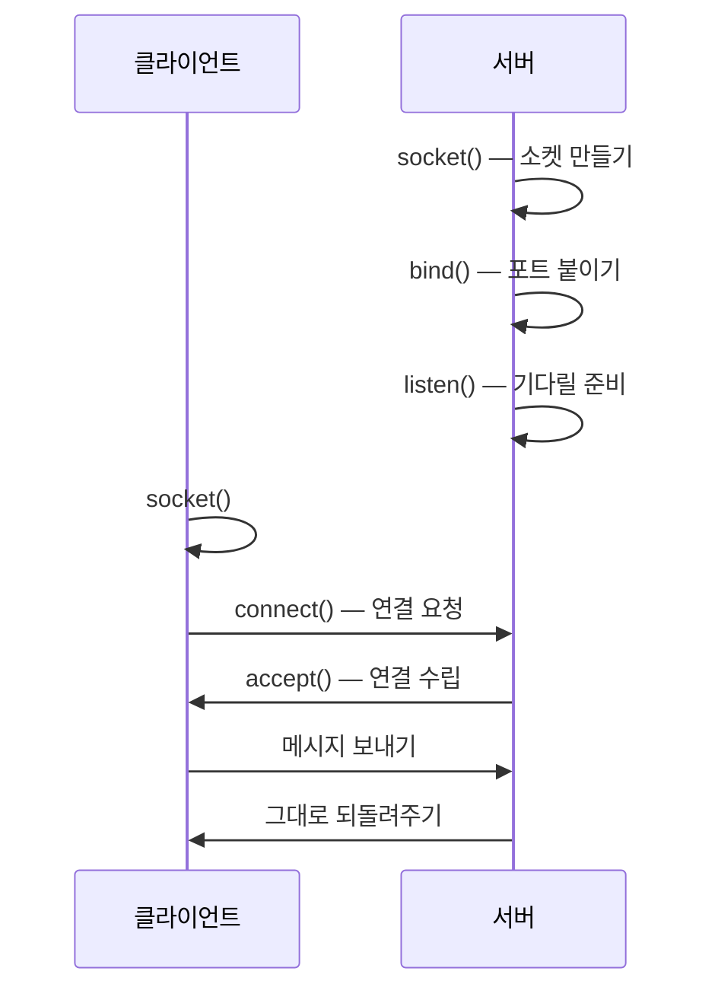

> 크래프톤 정글 기간에 쓴 글을 2026-08-21에 다시 정리했다.
{: .prompt-info }

## 이번 주 목표

> 주가 시작할 때 세운 목표다.
{: .prompt-info }

이번 주에 하기로 한 것은 세 가지다.

1. CSAPP 11장으로 네트워크 프로그래밍 기초 학습하기
2. `echo_client`와 `echo_server`, 그리고 웹 서버 `tiny.c` 직접 구현하기
3. 수요 코딩회에서 **미니 DBMS와 API 서버 연결하기**

여기까지가 최소 핵심 목표다. 
가능하다면 **CSAPP 숙제와 프록시 서버(`proxy.c`)까지** 해보는 것을 추가 목표로 잡았다.

## 어디까지 어떻게 시도했는가

### CSAPP 11장 학습 — 11.4장까지

소켓 프로그래밍 개념부터 클라이언트-서버 모델, IP 주소와 포트까지 순서대로 진행했다. 
서버가 어떻게 요청을 받고 응답을 보내는지 전체 그림이 잡혔다.

처음에는 `socket()`, `bind()`, `listen()`, `accept()`가 각각 무슨 역할인지 머릿속에서
잘 정리되지 않았다. 그런데 실제 서버 코드를 작성하면서 **각 함수가 연결 수립 과정의
어느 단계에 대응하는지** 눈에 들어오기 시작했다.

이론으로만 읽을 때와 직접 코드로 연결할 때의 이해도 차이가 확실히 있었다.

### echo_client.c / echo_server.c 구현

서버가 클라이언트의 메시지를 그대로 돌려주는 에코 서버와 클라이언트를 구현했다. 
소켓 생성부터 연결 수락, 읽기·쓰기, 연결 종료까지 전체 흐름을 직접 손으로 짰다.

구현하면서 가장 신경 쓴 부분은 **RIO 함수 적용**이었다. 
연결이 처음 성공하고 터미널에서 데이터가 실제로 오가는 걸 확인했을 때,
지금까지 추상적으로만 알던 네트워크 통신이 손에 잡히는 느낌이었다.

### tiny.c 구현 — 간이 웹 서버

각 함수 단위로 완성했다.

| 함수 | 하는 일 |
|---|---|
| `read_requesthdrs` · `parse_uri` | 요청 파싱 |
| `get_filetype` | Content-Type 판별 |
| `clienterror` | 에러 응답 |
| `serve_static` | 정적 파일 전송 — `mmap`으로 파일을 메모리에 매핑 |
| `serve_dynamic` | CGI 기반 동적 콘텐츠 — `fork` + `execve`로 자식 프로세스를 CGI로 교체 |

**다만 전체 트랜잭션을 조율하는 `doit()`은 구현하지 못했다.** 
각 부품은 다 만들었는데 조립을 못한 셈이라 아쉬움이 남았다.

그래도 HTTP 요청·응답 구조, `mmap`의 효율성, `fork`-`exec` 패턴을 함수 단위로 직접
구현하면서 웹 서버가 실제로 어떻게 동작하는지 몸에 익혔다.

### 미니 DBMS와 API 서버 연결

6·7주차에 구현한 미니 DBMS에 API 서버를 붙였다. 
클라이언트가 HTTP 요청을 보내면 API 서버가 쿼리를 파싱해 DBMS에 전달하고,
결과를 응답으로 돌려주는 구조였다.

핵심은 **rwlock을 적용한 동시성 처리**였다. single thread와 multi thread 환경에서
각각 벤치마크를 측정했다.

## 새롭게 배운 점

### mmap — 파일을 읽는 게 아니라 메모리에 붙인다

`serve_static`에서 파일을 보낼 때 두 가지 길이 있다.

- **읽어서 보내기** — 파일을 버퍼로 `read` 한 다음 그 버퍼를 `write` 한다.
  파일 내용이 커널에서 내 버퍼로 한 번 복사된다
- **`mmap`으로 붙이기** — 파일을 **메모리 주소에 그대로 매핑**한다.
  그 주소를 바로 `write` 하면 되니 중간 복사가 없다

이 차이를 이해한 게 이번 구현의 가장 큰 수확이었다.

### rwlock — 읽기는 같이, 쓰기는 혼자

| | lock 동작 | 벤치마크 결과 |
|---|---|---|
| **SELECT** | read lock — 여러 스레드가 **동시에** 읽어도 서로 막지 않는다 | multi thread가 single thread보다 **훨씬 빠름** |
| **INSERT** | write lock — 한 스레드가 쓰는 동안 나머지는 **전부 대기** | rwlock을 써도 **차이가 거의 없음** |

읽기끼리는 서로 방해하지 않으니 동시에 해도 되지만, 쓰기는 하나가 끝나야 다음이
들어갈 수 있다. **그래서 INSERT는 스레드를 늘려도 빨라지지 않는다.**

그리고 **lock을 아예 안 걸었을 때는 multi thread 환경에서 INSERT 불일치가 발생했다.** 
lock을 적용하니 불일치가 사라졌다. **race condition을 수치로 직접 확인한 순간**이었다.

## 이번 주 아쉬웠던 점

**tiny.c** — `doit()`을 구현하지 못했고, `proxy.c`는 아예 손도 못 댔다.

**미니 DBMS** — 완성이 너무 늦어져서 **코드 리뷰를 꼼꼼하게 하지 못했다.**

## 다음 주 계획

다음 주는 **PintOS PROJECT 1 — Threads** 구현에 집중한다. 
KAIST PintOS Assignment를 기반으로 팀원들과 함께 테스트 케이스를 통과하는 것이 목표다.

이번 주까지는 코드를 각자 짰지만, **이번 프로젝트부터는 팀 단위로 하나의 코드베이스를
관리**하기 때문에 PR 리뷰와 브랜치 전략도 함께 챙겨야 한다.

이론으로만 접했던 스레드와 동기화 개념을 실제 OS 코드 레벨에서 구현해보는 만큼,
이번 주에 배운 rwlock과 동시성 처리 경험이 직접적으로 연결될 것 같다.
