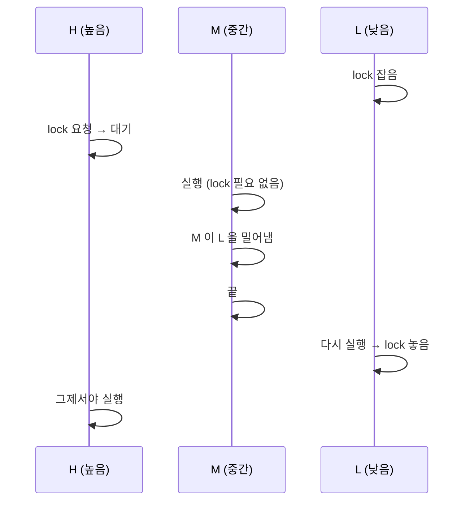

> 크래프톤 정글 기간에 쓴 글을 2026-08-23에 다시 정리했다.
{: .prompt-info }

## 이번 주 목표

> 주가 시작할 때 세운 목표다.
{: .prompt-info }

이번 주의 핵심은 **운영체제의 심장부, 스레드를 직접 만들어보기**다. 
큰 줄기는 셋이었다.

1. **커널 수준의 스레드를 직접 생성하고 스케줄링하는 흐름 이해하기** 
   운영체제가 어떤 스레드를 언제 실행할지 결정하는 원리를 코드로 구현한다
2. **동기화 도구를 체득하기** 
   여러 스레드가 동시에 돌 때 생기는 race condition을 직접 겪어보고,
   semaphore·lock·condition variable로 풀어본다. **「왜 이게 필요한지」를 느끼는 것**이 목표다
3. **팀으로 하나의 코드베이스를 만드는 협업 흐름 익히기** 
   개인 브랜치에서 작업하고 PR로 master에 합치는 방식을 이번 주부터 본격적으로 시작한다

## 어디까지 어떻게 시도했는가

### 우리 팀의 협업 방식

구현 이야기 전에 팀이 어떻게 일했는지부터 짚어야 할 것 같다.

- 각자 순서대로 과제를 구현한다
- **매일 저녁 9시 코어타임**에 서로의 코드를 리뷰한다
- 코드를 보여주는 데 그치지 않고 **「나는 왜 이렇게 짰는지」를 설명**한다
- 어떤 코드를 `main`에 merge할지 **팀 전체가 토론해서** 결정한다
- 그날 저녁 merge하고, 다음 날 각자 pull 받아 이어간다

### Alarm Clock

가장 먼저 건드린 부분이다. 원래 PintOS의 `timer_sleep()`은 **busy-wait** 방식이다.
쉽게 말해 타이머가 만료될 때까지 CPU를 잡고 놓지 않는다.
이걸 **sleep/wakeup 방식으로 바꾸는 것**이 첫 번째 과제였다.

스레드가 잠들어야 할 시점을 기록하고, 타이머 인터럽트가 발생할 때마다 깨울 스레드가 있는지
확인하는 흐름을 만들었다. 
머릿속으로 그림은 그려졌는데 막상 코드로 옮기려니 훨씬 막막했다.
결국 혼자서 다 완성하지 못했고, 팀원의 코드를 `main`에 merge해서 다음 단계로 넘어갔다.

팀 협업의 의미이기도 하지만, 한편으로는 **찜찜함이 남는 출발**이었다.

### Priority Scheduling

스레드마다 우선순위가 있고, 항상 가장 높은 우선순위의 스레드가 먼저 실행되어야 한다.

나는 일반적인 방식대로 **하나의 리스트를 우선순위 기준으로 관리**하는 구현을 했다. 
그런데 코어타임에서 한 팀원이 다른 방식을 들고 왔다. `ready_queues[PRI_MAX+1]` 형태의 배열,
즉 **우선순위마다 별도의 큐**를 두는 구조였다. 그 팀원이 「다른 팀과 차별점을 만들어 보자」며
적극적으로 밀었고, 코드도 가장 깔끔했다.

토론 끝에 그 팀원의 코드가 `main`에 merge되었다. 내 구현이 틀린 건 아니었지만,
더 명확한 코드 앞에서 자연스럽게 결론이 났다.

돌이켜보면 **내가 테스트 케이스를 거의 신경 쓰지 않고 구현했다는 것**도 한몫했다.
일단 동작하면 된다는 생각으로 달렸는데, 정작 **「어떤 상황에서 맞게 동작해야 하는지」** 를
제대로 확인하지 않았다. 
이때부터 테스트 케이스의 중요성을 몸으로 느끼게 되었다. **구현과 검증은 따로 가는 게 아니라는 걸.**

### Priority Donation

이번 주에서 가장 머리가 아팠던 곳이다.

하루를 통째로 개념 학습에 썼다. 어느 정도 이해했다고 생각하고 구현에 들어갔는데 중간에 막혔다. 
마무리를 못 한 채로 코어타임에 들어갔고, 내 코드를 리뷰하면서도 스스로 길을 잃었다.
그래서 내가 이해한 개념을 팀원들에게 설명해봤는데 — **알고 보니 처음부터 개념을 잘못 잡고 있었다.**

다른 팀원들은 그 하루 동안 개념도 잡고 구현도 꽤 진도를 뺐는데, 나는 밤 11시가 넘어서야
개념을 처음부터 다시 공부해야 하는 상황이 됐다. 하루가 밀린 셈이었다. 
민폐가 되는 것 같아 조급했고, 결국 **`donate-one`과 `donate-multiple` 테스트 케이스만 통과한 채로**
이번 주를 마무리했다. 나머지 케이스들은 손을 대지 못했다.

### 목요일 발표

목요일에는 팀별 발표가 있었다. 내가 맡은 파트는 둘이었다.

**Priority Donation 개념 설명** — Priority Inversion이 왜 생기는지, 그래서 Donation이 왜 필요한지,
우선순위가 어떻게 양도되고 복원되는지를 설명했다. 
직접 개념을 잘못 이해했다가 밤새 다시 잡은 경험이 있어서인지 **「여기서 헷갈리기 쉬운 이유」를
꽤 자연스럽게 짚을 수 있었다. 실패가 설명의 재료가 된 셈이다.**

**프로젝트 회고** — 이번 주 팀이 어떻게 협업했는지를 정리해서 발표했다.
`test.c` 함수를 직접 타고 들어가며 PintOS 내부 동작 원리를 학습한 것, 각자 구현 후 코어타임에서
코드를 비교하고 merge 방향을 논의한 것, 어려운 부분은 함께 해결해 나간 것. 
그리고 미완성으로 끝난 부분은 다음 주에 시간을 더 써서 완성도를 높이겠다는 계획도 공유했다.

## 새롭게 배운 점

### Priority Inversion — 우선순위가 뒤집히는 순간

세 가지가 겹칠 때 생긴다.

- 높은 우선순위 스레드(**H**)가 낮은 우선순위 스레드(**L**)를 기다린다
- 그 사이 중간 우선순위 스레드(**M**)가 끼어들어 먼저 실행된다
- 이 모든 것이 **lock 경쟁**에서 비롯된다

우선순위는 **H > M > L**인데, 실제 실행 순서는 **M → L → H**가 된다. 
**가장 높은 스레드가 가장 늦게 실행되는 역설이다.**

### Priority Donation — 우선순위를 빌려준다

핵심은 둘이다.

| | 무엇을 하나 |
|---|---|
| **양도** | lock을 요청하는 스레드가 더 높은 우선순위면, **lock을 쥔 스레드에게 그 우선순위를 넘겨준다.** 이때 여러 단계의 donation 체인이 생길 수 있다 |
| **복원** | lock이 해제되면 원래 우선순위로 돌아온다. 여러 lock을 쥐고 있다면 **그중 가장 높은 donated 우선순위를 유지**하다가, 모든 lock이 풀린 뒤에야 완전히 복원된다 |

L에게 H의 우선순위를 빌려주면 **M이 L을 밀어내지 못한다.** L이 빨리 끝내고 lock을 놓으니
H도 빨리 실행된다.

## 이번 주 아쉬웠던 점

**방향은 옳았는데 나침반이 틀렸다** — 이번 주 나의 방식은 개념을 먼저 다지고 구현에 들어가는
것이었다. 그 방향 자체는 맞았다고 생각한다. 
문제는 Priority Donation에서 **개념을 잘못 잡은 채로 시간을 쏟아부었다는 점**이다.

**끝까지 내 손으로 마무리하지 못했다** — Alarm Clock도, Priority Scheduling도,
Priority Donation도 어느 하나 완전히 내 힘으로 완성했다고 말하기 어렵다. 
팀 협업의 구조상 자연스러운 결과이기도 했지만, 그게 오히려 더 찜찜하게 남는다.
**「팀 코드가 통과됐다」는 것과 「내가 구현할 수 있다」는 건 다른 이야기니까.**

그래서 **개인 저장소를 따로 파서** 각 과제를 처음부터 끝까지 혼자 완성해보고 싶다는 생각이 들었다.
테스트를 통과하는 것보다 **「내가 왜 이렇게 짰는지」 스스로 설명할 수 있는 상태**가 되는 게 목표다.

**MLFQS를 손도 못 댔다** — 원래 계획에는 있었지만 Priority Donation에서 시간을 많이 써서
다음 주로 미뤄졌다.

## 다음 주 계획

다음 주는 **PROJECT 2 — User Programs**로 넘어간다. 이번 주와는 결이 다른 주제들이 기다린다.

핵심은 **사용자 프로그램이 커널의 제어 아래 안전하게 실행되는 전체 흐름**을 이해하고 구현하는 것이다.
구체적으로는 ELF 로더, 시스템 콜, 파일 디스크립터, 그리고 유저-커널 주소 검증까지.

이번 주가 스레드 내부 동작에 집중했다면, 다음 주는 **사용자 프로그램이 커널을 어떻게 호출하고,
커널이 그것을 어떻게 안전하게 처리하는지**를 다룬다.
User Mode와 Kernel Mode가 나뉘는 이유, 그 경계에서 일어나는 일들을 직접 손으로 만들어 보게 된다.

이번 주에 못 했거나 부족한 부분은 **개인 저장소를 따로 파서 틈틈이 마무리할 계획**이다.
팀 코드가 넘어가더라도, **내 손으로 끝까지 짜본 적 없는 코드는 내 것이 아니라는 걸** 이번 주에
분명히 느꼈다.

다음 주는 개념을 먼저 단단히 다지고 들어가는 방식을 더 철저하게 지키고 싶다. 
이번 주에 나침반이 틀렸던 경험 덕분에 **개념을 검증하는 습관**의 중요성을 배웠다.
팀원에게 설명해보는 것도, 스스로 말로 풀어보는 것도 — 이해를 확인하는 방법으로 적극 활용할 생각이다.